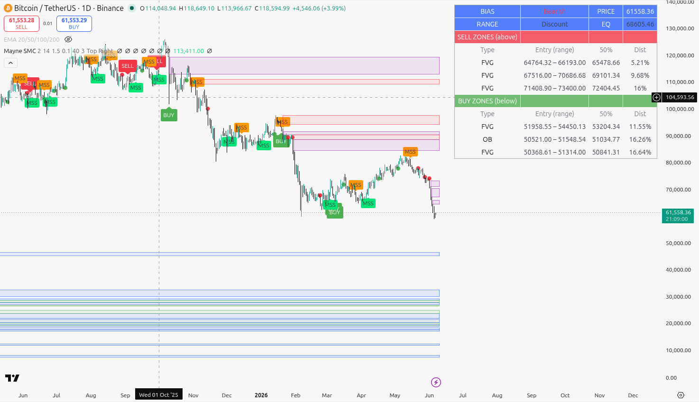

# Trading Scripts

A collection of trading indicators and study guides I've built while learning Smart Money Concepts
(SMC) from free educational content on YouTube. Each subfolder is one source/creator, with the
indicator code, a how-to README, and (where it helps) an illustrated HTML guide.

> ## Not financial advice
> Everything here is for **education and testing only**. These are mechanical approximations of
> discretionary trading methods — they are **not** trade signals, recommendations, or financial
> advice. Markets are risky; you can lose money. Backtest anything before relying on it and manage
> your own risk. Nothing here is a guarantee of any outcome.

## Collections

| Folder | Source | What's inside |
|---|---|---|
| [`mayne-smc/`](./mayne-smc) | [Trader Mayne](https://www.youtube.com/@TraderMayne) — [Trading Bootcamp playlist](https://www.youtube.com/playlist?list=PLKItFyoma4GeQSNjY7LM5qtEgTFUidxYI) | Pine v6 SMC indicator (order blocks, FVGs, market-structure bias, BUY/SELL signals) + an interactive visual guide (`guide.html`). |

More collections from other channels may be added over time, each in its own folder.

## Versioning

Each collection is versioned independently — see the `CHANGELOG.md` inside its folder (e.g.
[`mayne-smc/CHANGELOG.md`](./mayne-smc/CHANGELOG.md)). Versioning is loosely semantic: MAJOR for
breaking changes to behaviour, MINOR for new features/inputs, PATCH for fixes and doc tweaks. These
scripts are updated from time to time.

## Attribution

The trading methods belong to their respective creators. These are **independent, unofficial fan
implementations** — not affiliated with, sponsored by, or endorsed by any creator listed. All
credit for the methods is theirs; the code and notes are my own interpretation. Watch the original
videos for the full teaching.

## License

Released under the [MIT License](./LICENSE). The license covers **my original work** in this
repo — the indicator code, the HTML guides, and my written notes. It does not claim any rights
over the underlying trading methods, which belong to their creators (trading concepts are ideas,
not licensable here). Reuse the code freely under MIT; credit the original creators for the method.
