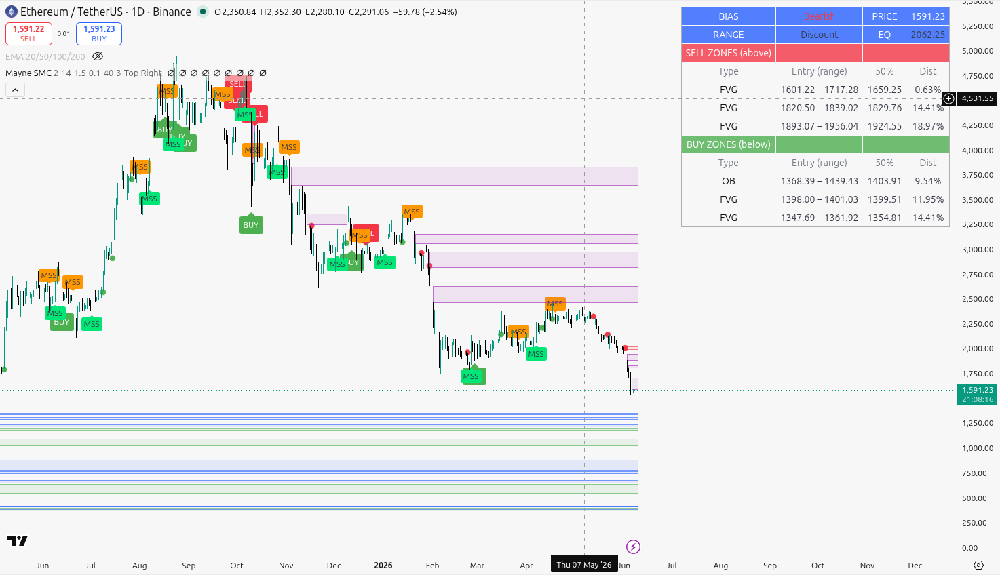
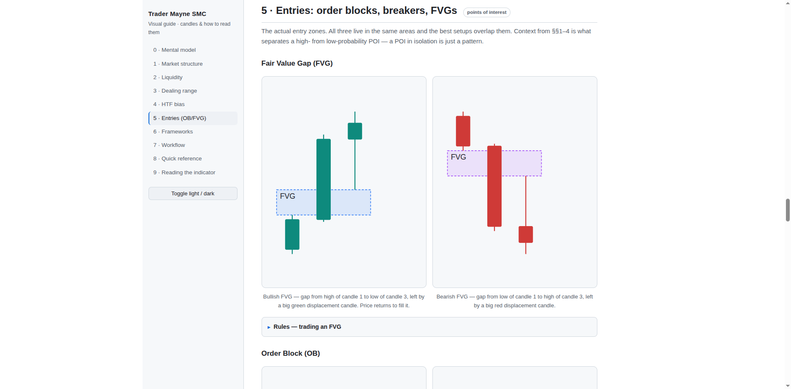

# Mayne SMC Indicator

**Version 1.0.0** · [changelog](./CHANGELOG.md)

A Pine Script v6 (TradingView) indicator that mechanically marks the entry pieces of the Trader
Mayne Smart Money Concepts system: **order blocks, fair value gaps, market-structure bias, the
dealing-range 50%, and BUY/SELL signals**.

- **`Mayne-SMC-Indicator.pine`** — paste into TradingView's Pine Editor (install steps below).
- **`guide.html`** — open in any browser for an interactive, illustrated walkthrough of the whole
  Mayne SMC method (candle diagrams for every concept) plus how to read this indicator. Start there
  if the concepts are new.

> **Not financial advice.** This is a study/testing tool. The signals are a mechanical
> approximation of a discretionary method. Backtest before you trust anything it prints, and size
> your own risk.

## Preview

The indicator on a daily BTC/USDT chart — BUY/SELL labels, MSS markers, order-block / FVG zones,
and the nearest buy/sell **zone table** (top-right):


Same indicator on ETH/USDT:



The interactive `guide.html` — illustrated candle diagrams for every concept, with a sidebar,
collapsible rules, and a light/dark toggle:



### Source & attribution

Derived from **Trader Mayne**'s free educational series on YouTube:

- Channel: <https://www.youtube.com/@TraderMayne>
- Playlist (Trading Bootcamp / Whiteboard Series): <https://www.youtube.com/playlist?list=PLKItFyoma4GeQSNjY7LM5qtEgTFUidxYI>

This is an **independent, unofficial fan implementation** — not affiliated with, sponsored by, or
endorsed by Trader Mayne. All credit for the trading method is his; the code and notes here are my
own interpretation. Watch the original videos for the full teaching and chart examples.

---

## Which timeframe do I put this on?

The indicator is **single-timeframe** — it reads bias and fires signals off whatever chart you
open it on. Mayne trades **top-down**, so you run it on more than one chart and let the higher one
rule the lower. His stack:

| Timeframe | Job | Role here |
|---|---|---|
| **Weekly** | Macro direction — the "boss" | HTF bias |
| **Daily** | Major swings / where you are in the trend | HTF bias |
| **H4** | Local trend (last few days–2 weeks) | bridge |
| **H1 / M15** | Where you actually enter | LTF entries |

**The two execution pairs Mayne names** — read bias on the higher chart, take the entry on the
lower. Run the indicator on both: BIAS row on the top one, BUY/SELL signals on the bottom one.

| HTF (read BIAS) | LTF (take the signal) | Use when |
|---|---|---|
| **H12** | **H1** | Standard / swing pace. Pairs with a bearish-or-bullish Weekly above it. |
| **H4** | **M15** | Faster, smaller setups (tighter stops, more frequent). |

Don't jump Weekly straight to an hourly entry — step down through the hierarchy. Keep the Weekly
open just to confirm you're not fighting the macro. The tool doesn't sync timeframes for you — that
top-down read is the one judgment call Mayne wants you making yourself.

---

## Install (2 minutes)

1. Open TradingView, bottom panel → **Pine Editor**.
2. Open `Mayne-SMC-Indicator.pine`, copy the whole file, paste it over the editor contents.
3. Click **Add to chart**.
4. (Optional) Gear icon on the indicator → tune the inputs (below).
5. (Optional) Right-click a signal → **Add alert** → pick "Mayne SMC BUY" / "SELL".

---

## What you'll see on the chart

| Element | On by default? | Meaning |
|---|---|---|
| **"BUY" / "SELL" labels** | yes | A signal fired (rules below). The thing you actually trade off. |
| **Blue / purple boxes** | yes | Fair Value Gaps — blue = bullish, purple = bearish. |
| **Green / red boxes** | yes | Order Blocks — green = bullish (demand), red = bearish (supply). |
| **Dots above/below bars** | yes | **MSB** — structure break in the trend direction (continuation). Green dot below = bullish, red dot above = bearish. |
| **"MSS" labels** | yes | **MSS** — the first break *against* the trend (potential reversal / change of character). It flips the bias. Lime up / orange down. |
| **Gray lines (high / low)** | **off** | Dealing range: last swing high (BSL above) / swing low (SSL below). Toggle: *Show range high/low + equilibrium lines*. |
| **Orange line** | **off** | Equilibrium — the **50%** of the range. Above = premium, below = discount. Same toggle as above. |
| **Green/red background tint** | **off** | Trend bias on every bar. Floods the chart, so it's off by default — toggle: *Tint background by bias*. |

**Zones stop extending once used.** A box only stretches to the live bar while price *hasn't*
reached it. The moment price trades into a zone's 50% mean threshold, that zone is "mitigated"
(spent) and its box **freezes** at the bar it was hit — so old, filled zones become short
historical boxes instead of long bars blocking the chart, and only the still-actionable
(untouched) zones reach the present. Toggle: *Zone display → Stop extending zones once mitigated*
(on by default; turn off to extend every box to the present like before).

If the chart still feels busy, the **boxes** are the next thing to thin out: raise *Swing length*
and *Displacement >= ATR x*, or turn off *Show FVGs* / *Show Order Blocks* to leave only the
BUY/SELL labels.

---

## The zone table (top-right)

A panel that reads off the nearest **buy zones below price** (demand: bullish OBs/FVGs) and
**sell zones above price** (supply: bearish OBs/FVGs), so you can see where price is likely
headed next without eyeballing the boxes.

```
BIAS   Bullish        PRICE   42,180
RANGE  Discount       EQ      41,900
SELL ZONES (above)
 Type  Entry (range)     50%      Dist
 OB    42,900 – 43,200   43,050   1.71%
 FVG   43,400 – 43,560   43,480   2.89%
BUY ZONES (below)
 Type  Entry (range)     50%      Dist
 FVG   41,650 – 41,790   41,720   0.92%
 OB    41,050 – 41,350   41,200   1.97%
```

- **Type** — OB (order block) or FVG (fair value gap).
- **Entry (range)** — the full zone, bottom – top. You ladder your order across it rather than
  filling at one price — the "spray across the zone" approach.
- **50%** — the zone's mean threshold, the optimal-fill point and the level the on-chart BUY/SELL
  signal fires at. A strong zone shouldn't trade past its 50%.
- **Dist** — how far the **near edge** of the zone is from current price, in % (i.e. how far price
  has to travel to first touch the zone).

Zones are listed **nearest-first**. Controls live in the **Zone Table** input group: toggle it on/off,
set how many zones per side (1–6), and pick the corner.

> The table lists *candidate* zones (everywhere price could react). A zone only becomes an actual
> **BUY/SELL signal** when price reaches it **and** bias + premium/discount agree — that's when the
> label prints on the chart. Read the table as "here's the map," the labels as "here's the trigger."

---

## How a signal is generated

A **BUY** prints only when **all** of these line up on the same bar:

1. **Bias is bullish** — price has broken structure to the upside (green MSB dot; enable *Tint background by bias* for the full tint).
2. **Price is in discount** — below the orange 50% line (toggle: *Require correct half*).
3. **Price retests a bullish POI** — it trades back into a bullish order block or bullish FVG,
   reaching that zone's **50% mean threshold** (toggle: *Trigger at zone 50%*).

**SELL** is the exact mirror: bearish bias + premium + retest into a bearish OB/FVG.

Each zone fires **once**. A zone is deleted when price closes through it (invalidated), so the
chart self-cleans. This maps to the system's non-negotiables: bias first, longs in discount /
shorts in premium, enter at the POI mean threshold.

---

## Inputs that matter

| Input | Default | Raise it to… |
|---|---|---|
| **Swing length** | 2 | Catch only bigger, more significant structure (fewer, cleaner swings). Use 3–4 on HTF. |
| **Marker distance from candle (×ATR)** | 0.1 | Push BUY/SELL/MSB/MSS markers further from the candle; lower = flush, 0 = right at the high/low. |
| **Displacement: range >= ATR x** | 1.5 | Demand stronger displacement candles before trusting an FVG/OB. |
| **Require displacement on middle candle** (FVG) | on | Filter weak gaps; off = mark every 3-candle gap. |
| **Only OBs whose move breaks structure** | on | Keep only order blocks whose displacement broke structure (highest-prob). |
| **Require correct half (discount/premium)** | on | Enforce the buy-low/sell-high rule. Turn off to see every POI retest. |
| **Trigger at zone 50%** | on | Signal at the zone midpoint (mean threshold). Off = signal on first touch of the zone edge. |

---

## Honest limits — what it does NOT do

- **Single timeframe only.** The core rule is HTF-leads-LTF, top-down. This reads bias from the
  chart's own timeframe. Keep your real HTF bias on a separate chart and treat a signal that
  disagrees with your HTF as noise.
- **No liquidity-sweep confirmation, no RR gate, no SMT / kill-zone / Judas logic.** Those are the
  discretionary edges; the script can't judge them. A signal means "a POI is being retested in the
  right local context" — not "take this trade."
- **Confirms with lag (not a bug).** Swings need `Swing length` bars to the right before they
  confirm, so structure and signals appear a few bars late rather than repainting.
